# 100-Bounding-Images-of-Cars.
This repository shows the 100 images of annotation with bounding box via CVAT.
It gives the annotation file in json and yolo file format, google drive link to the raw 100 images and some screenshot as of proof.
Contact: atharvmane1118@gmail.com 
## Annotation 
[Download COCO JSON ](annotation_100_bounding_box.json)
## Raw Images
https://drive.google.com/drive/folders/1mK92FYS2Jx8P18nm2kpuJcGKF3r74KYO?usp=sharing
## Screenshots
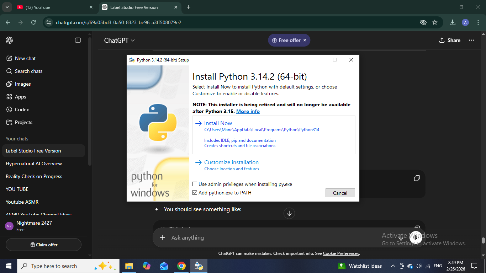
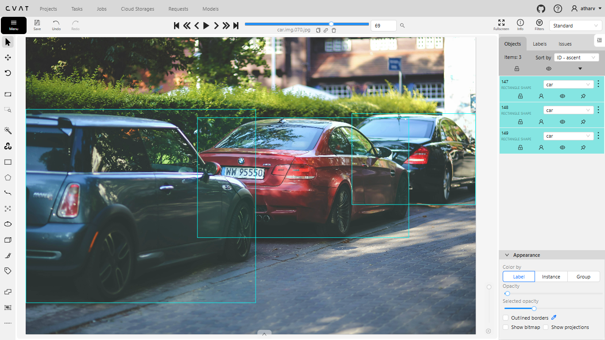
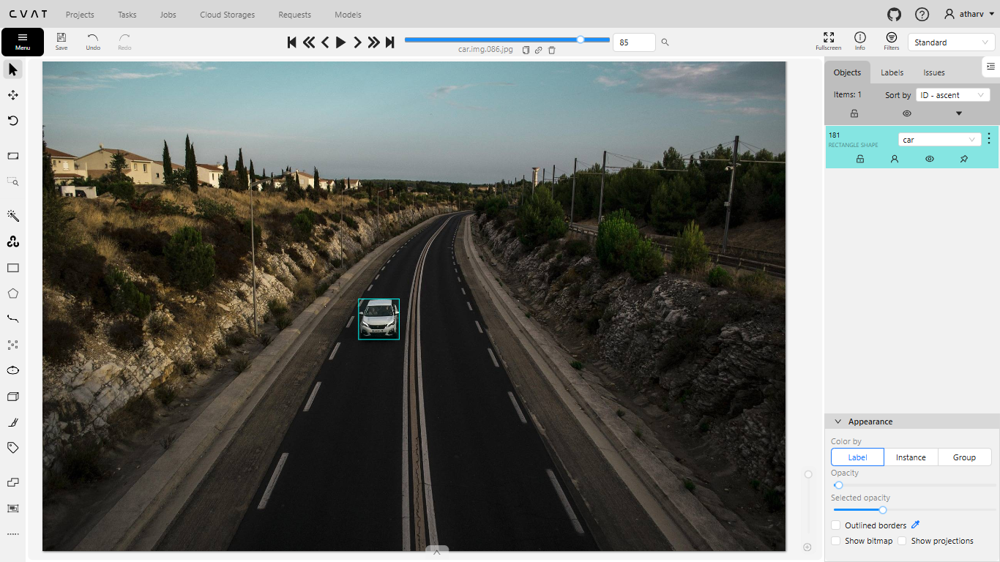
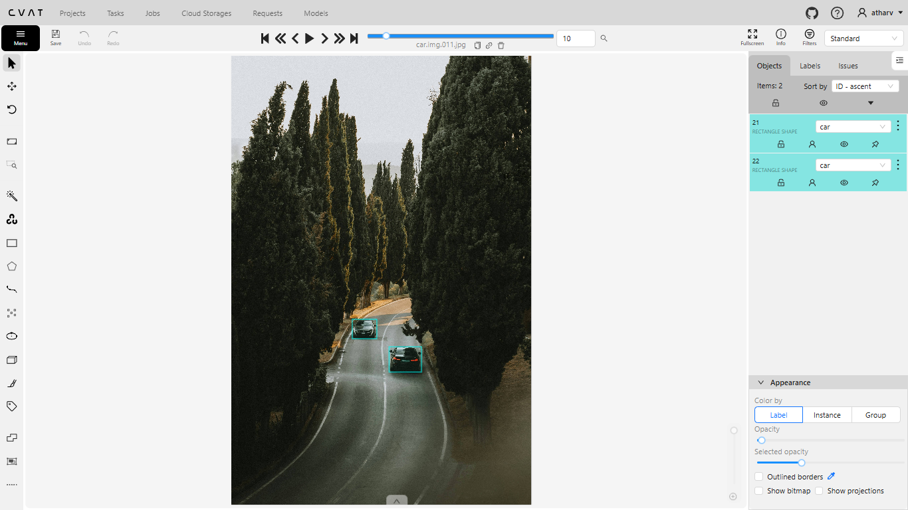
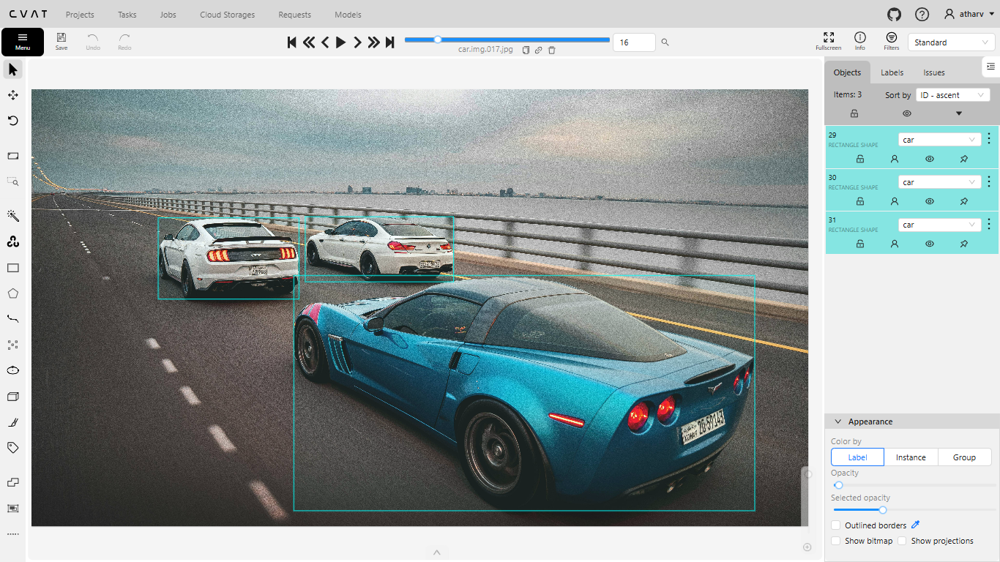
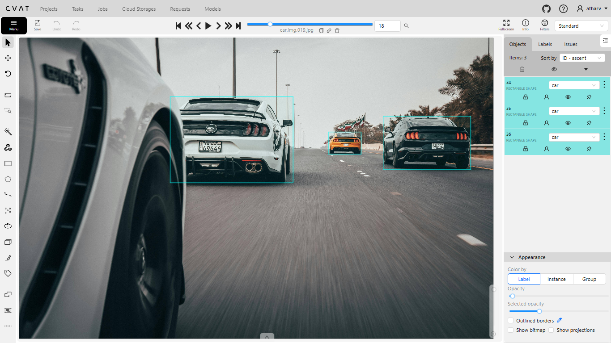
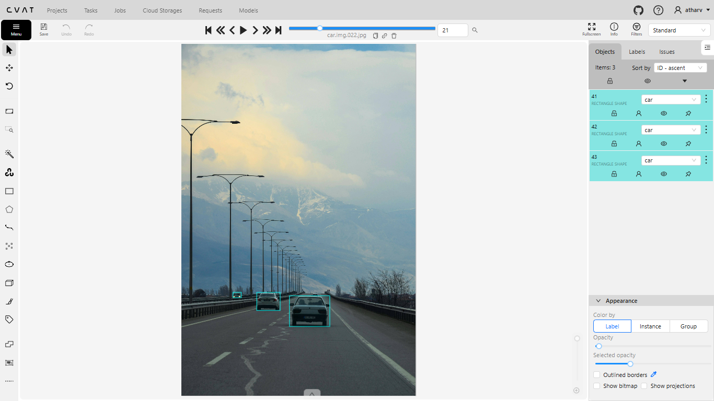
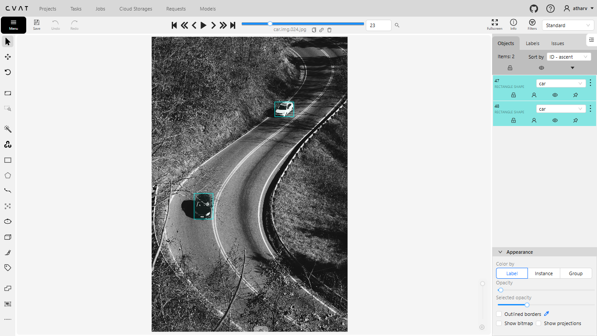
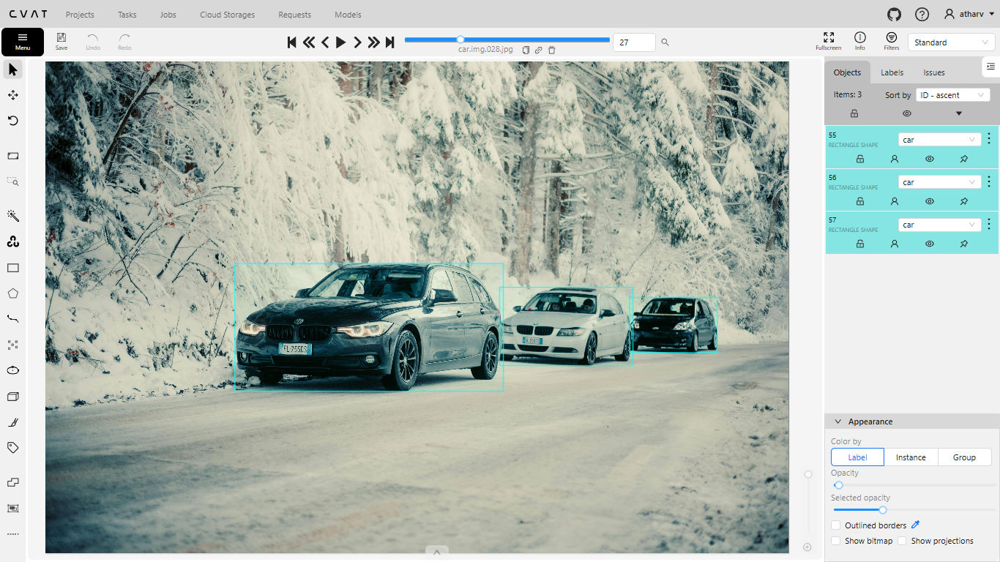
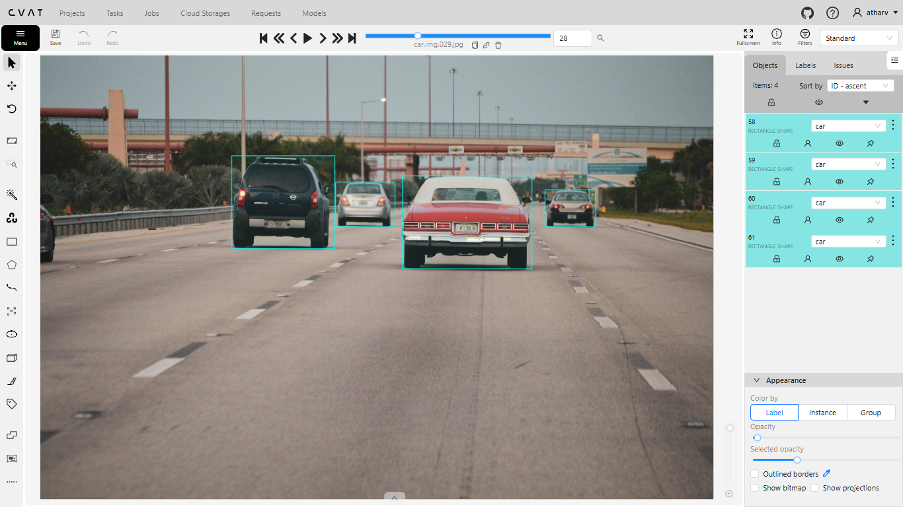
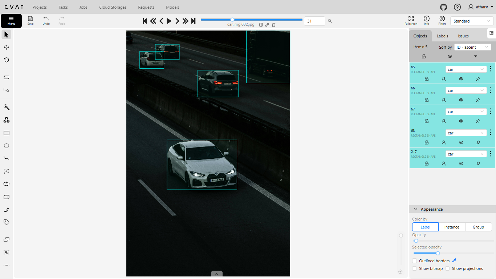
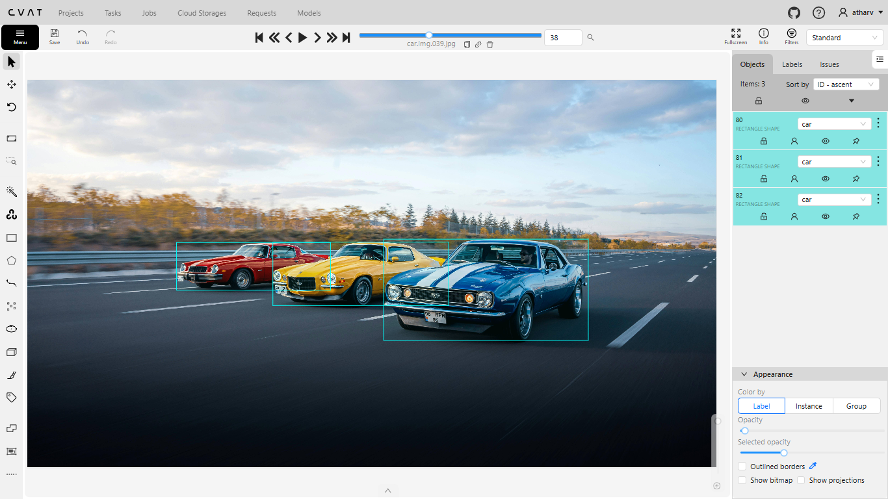
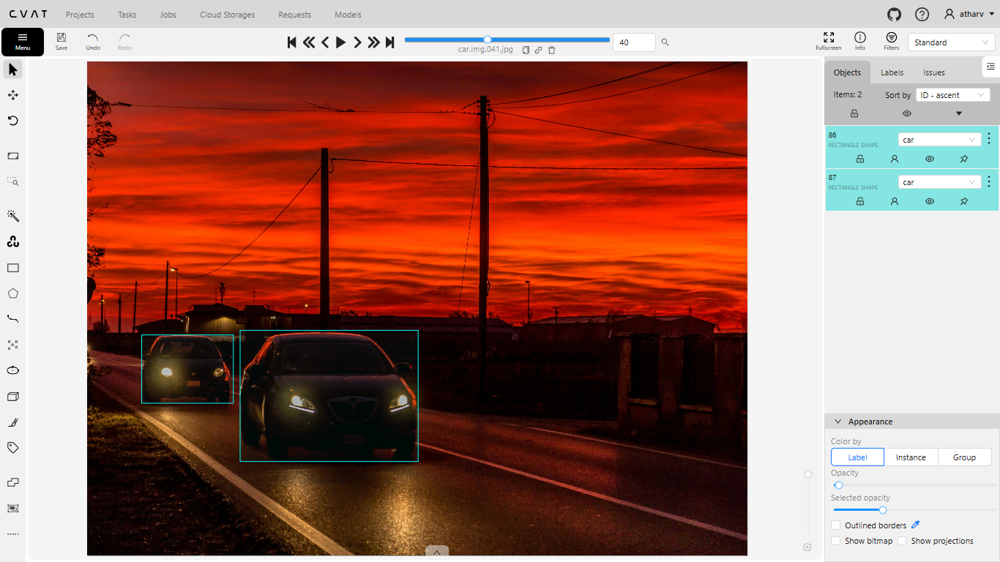
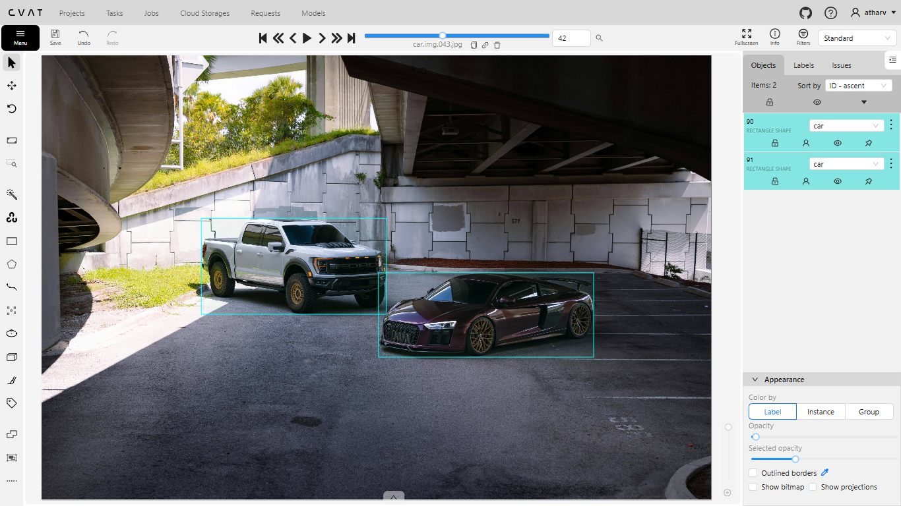
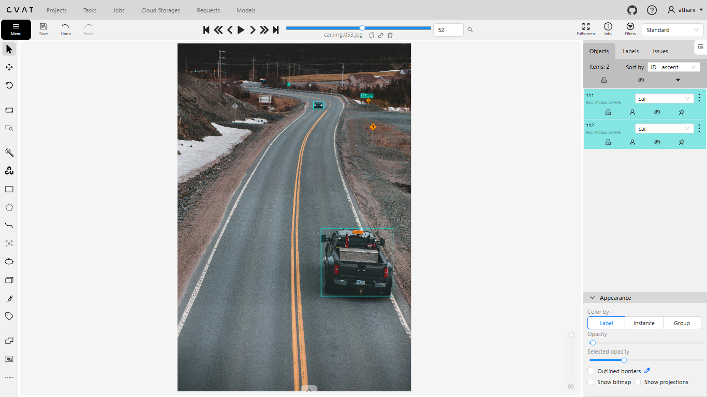
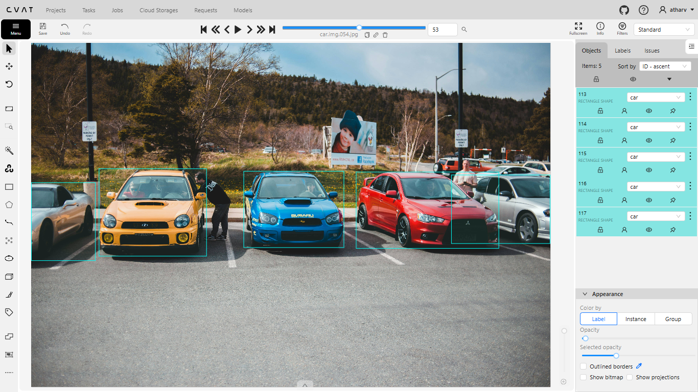
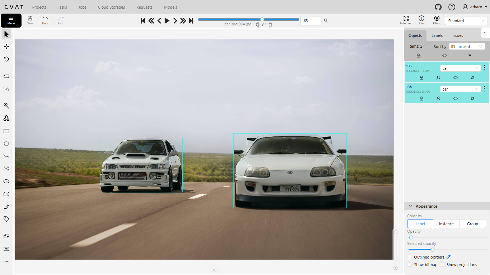
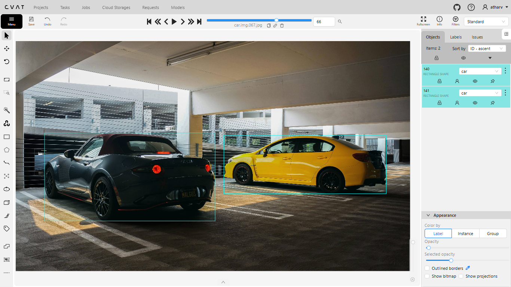

